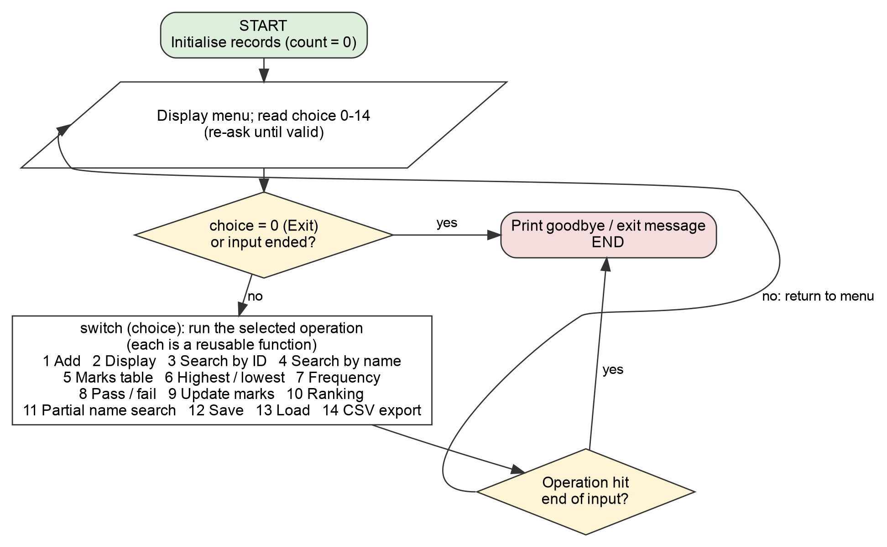
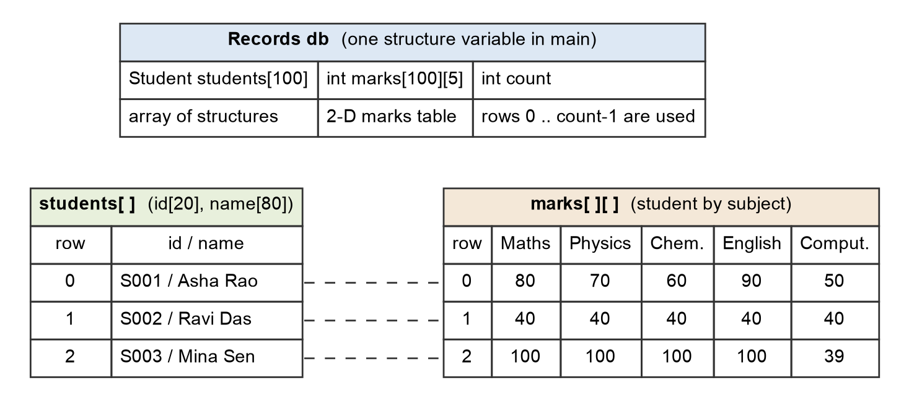
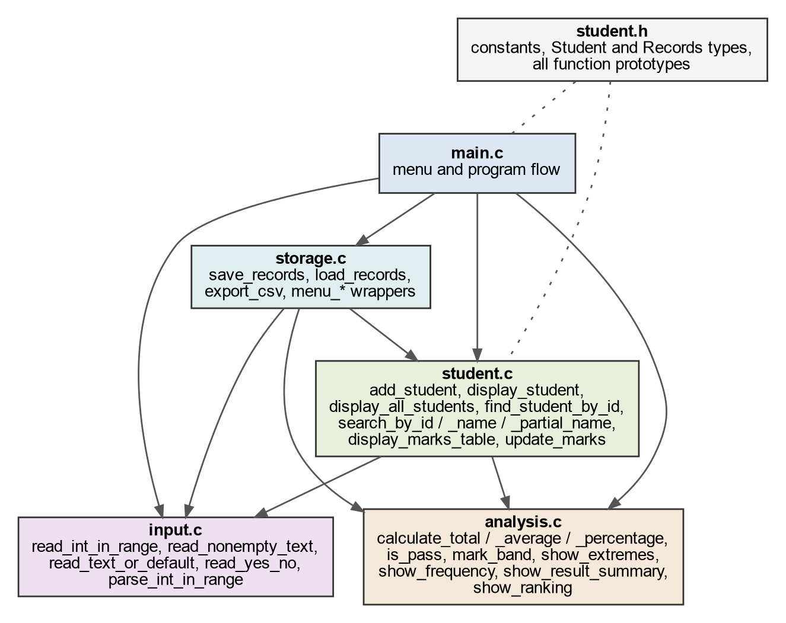
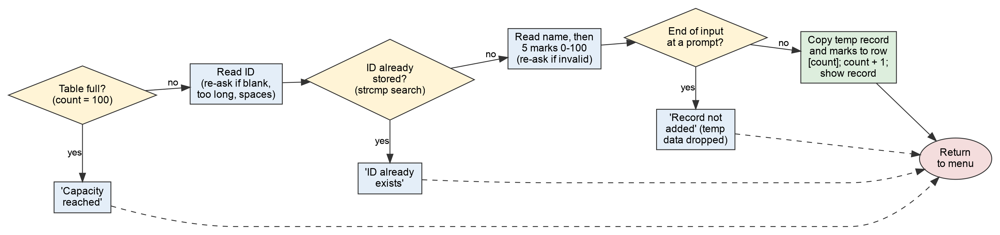
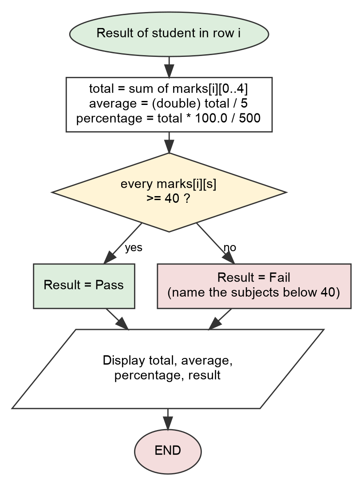

# Algorithms, Flowcharts and Data Model

All figures are in `docs/figures/` as PNG images with their Graphviz sources (`.dot`).
Regenerate one with `dot -Tpng docs/figures/fig1-main-flow.dot -o docs/figures/fig1-main-flow.png`.

## 1. Overall algorithm

```text
START
  Initialise records (count = 0)
  Repeat
      Display the menu (with records stored / capacity)
      Read a valid choice 0..14            (re-ask on invalid input)
      If input ended -> print message and stop
      Select the operation with switch and run it through its function
      If the operation reports end of input -> stop
  Until Exit (0) is chosen
END
```



## 2. Data model

`students[i]` and `marks[i]` describe the same person (row *i*). Occupied rows are `0 .. count-1`.
Marks are stored only in the two-dimensional table; totals, averages, percentages and results are
recalculated whenever needed.



```c
typedef struct { char id[20]; char name[80]; } Student;
typedef struct {
    Student students[100];     /* array of structures                */
    int     marks[100][5];     /* two-dimensional student x subject  */
    int     count;             /* rows 0 .. count-1 are in use       */
} Records;
```

## 3. Module structure



## 4. Algorithms of the required operations

### 4.1 Validated input (`input.c`)

```text
read_line(buffer):
    flush output so the prompt is visible
    fgets into buffer; if nothing could be read -> END OF INPUT
    if buffer holds a newline        -> complete line, remove it
    else if not at end of file       -> line was TOO LONG: discard the rest of the line
    trim leading and trailing white space

read_int_in_range(prompt, min, max):
    repeat
        print prompt; read_line
        end of input -> return EOF
        too long or blank -> message, ask again
        errno = 0; n = strtol(text, &end, 10)
        nothing converted, or *end is not '\0' ("42abc", "4.5") -> "not a whole number"
        errno == ERANGE or n < min or n > max                     -> "out of range"
        otherwise return n
```

### 4.2 Add student (`add_student`)

```text
if count = 100 -> "Capacity reached", return
read ID  (non-blank, <= 19 characters, no spaces)       re-ask when invalid
if ID already stored (linear search with strcmp) -> "ID already exists", return
read name (non-blank, <= 79 characters)                 re-ask when invalid
for each subject: read a mark 0..100                    re-ask when invalid
   (end of input at ANY prompt -> "record was not added", return)
copy temporary identity into students[count]
copy temporary marks   into marks[count][0..4]
count = count + 1                                       <- only now
display the saved record
```

The new data is held in temporary variables until everything is valid, so cancelling or rejecting a
duplicate can never leave a half-written record or an incorrect count.



### 4.3 Total, average, percentage and result

```text
total      = 0;  for s = 0..4: total = total + marks[i][s]
average    = (double) total / 5
percentage = total * 100.0 / 500
result     = Pass if marks[i][s] >= 40 for EVERY s, otherwise Fail
```

Floating-point division is required: `439 / 5` in integer arithmetic is 87, the correct average is 87.8.
Average and percentage have the same value when all subjects have the same maximum, but they mean
different things (marks per subject versus share of the maximum possible total).



### 4.4 Search

```text
by ID  : for i = 0 .. count-1: if strcmp(students[i].id, wanted) == 0 -> row i;  else NOT FOUND
by name: for i = 0 .. count-1: if strcmp(students[i].name, wanted) == 0 -> show student i
         (the whole table is always traversed, names are not unique)
         report how many matched; if none -> "No student found"
```

### 4.5 Highest and lowest

```text
if count = 0 -> "No records", stop            (never read row 0 of an empty table)
max = min = total of row 0                    (start from a REAL record, not from 0)
for i = 1 .. count-1: update max and min
print every student whose total equals max, then every student whose total equals min   (ties)
for each subject: the same procedure on the column marks[0..count-1][s]
```

### 4.6 Frequency analysis

```text
counts[subject][band] = 0 for all subject, band
for every student i and every subject s:
    band = 3 if mark >= 80, 2 if >= 60, 1 if >= 40, else 0
    counts[s][band] = counts[s][band] + 1
print each subject's counts; the row total must equal the number of students
```

Every valid mark falls in exactly one band: 0–39, 40–59, 60–79, 80–100.

### 4.7 Pass/fail summary

```text
pass = fail = 0
for every student: if is_pass(row) then pass = pass + 1 else fail = fail + 1
pass percentage = pass * 100.0 / count              (count > 0 guaranteed)
list each failed student with the subjects that are below 40
```

## 5. Algorithms of the optional enhancements

```text
update_marks : find student; copy marks[row] to a temporary array; repeatedly read
               "subject number" and "new mark" into the temporary array; when the user
               finishes (0) copy it back.  End of input -> nothing is changed.

ranking      : order[0..count-1] = 0..count-1          (indices, stored data stays put)
               insertion sort of order[] by total, highest first (stable)
               rank = position of the first student with that total  (1, 2, 2, 4 ...)

partial search: for each name, slide the typed text along it comparing tolower() of both.

save         : header line, then one line per student: ID TAB name TAB 5 marks (TAB separated)
load         : parse the whole file into a temporary table; validate header, field count,
               ID/name rules, marks 0..100, duplicate IDs and capacity; replace memory
               only if every line is valid.
csv export   : header row, then one row per student; a field containing a comma, quote or
               line break is wrapped in quotes and embedded quotes are doubled (RFC 4180).
```

## 6. Complexity (n = number of students, S = subjects)

| Operation | Time |
|---|---|
| Add (duplicate check) | O(n) |
| Search by ID or name | O(n) |
| Display, marks table, extremes, frequency, summary | O(n · S) |
| Ranking | O(n²) for insertion sort — fine for n ≤ 100 |

With n ≤ 100 and S = 5 every operation is effectively instantaneous.
