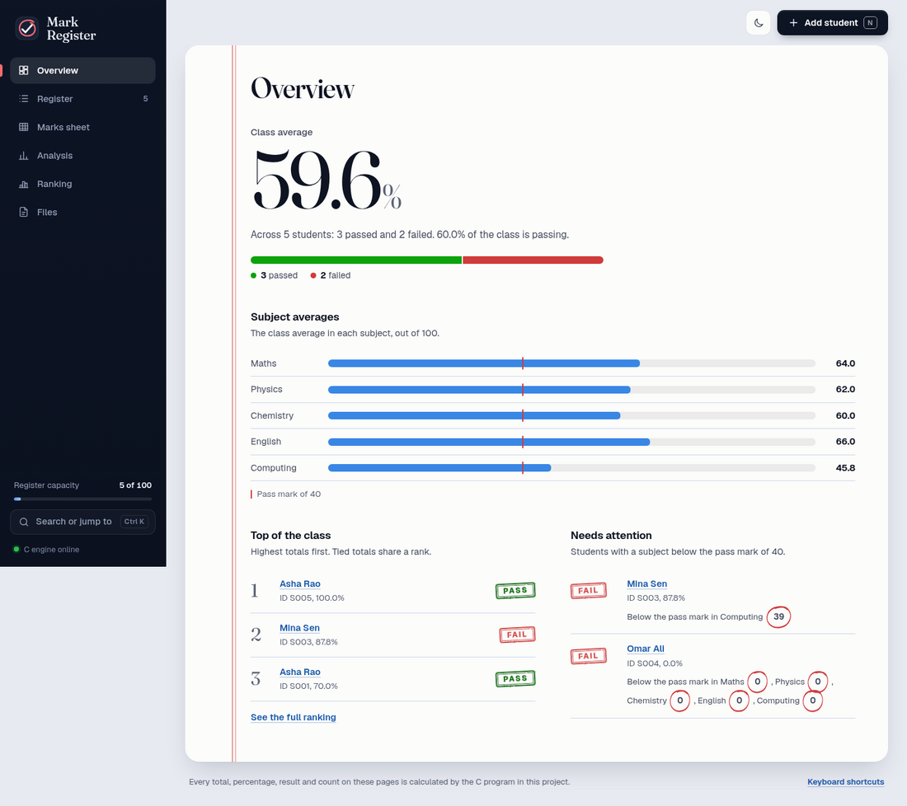
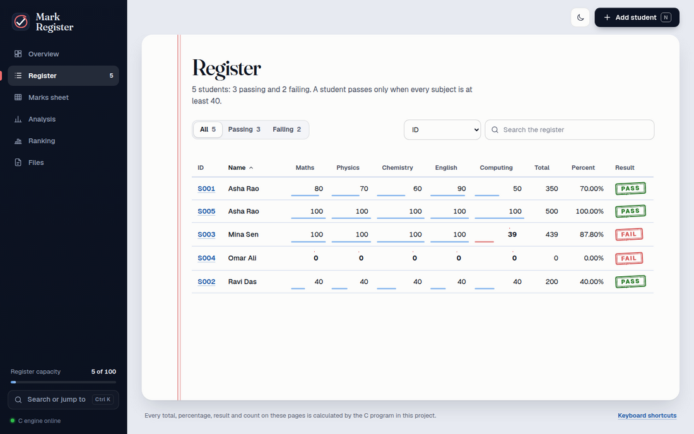
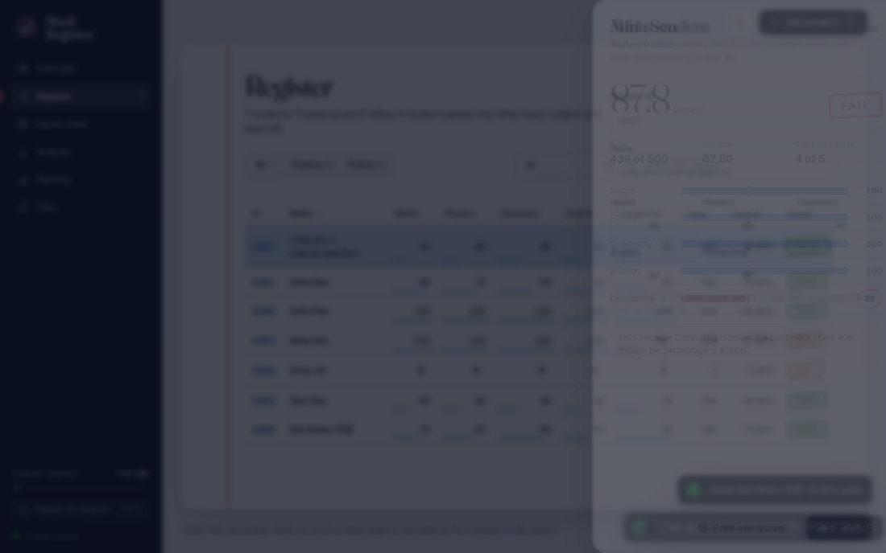
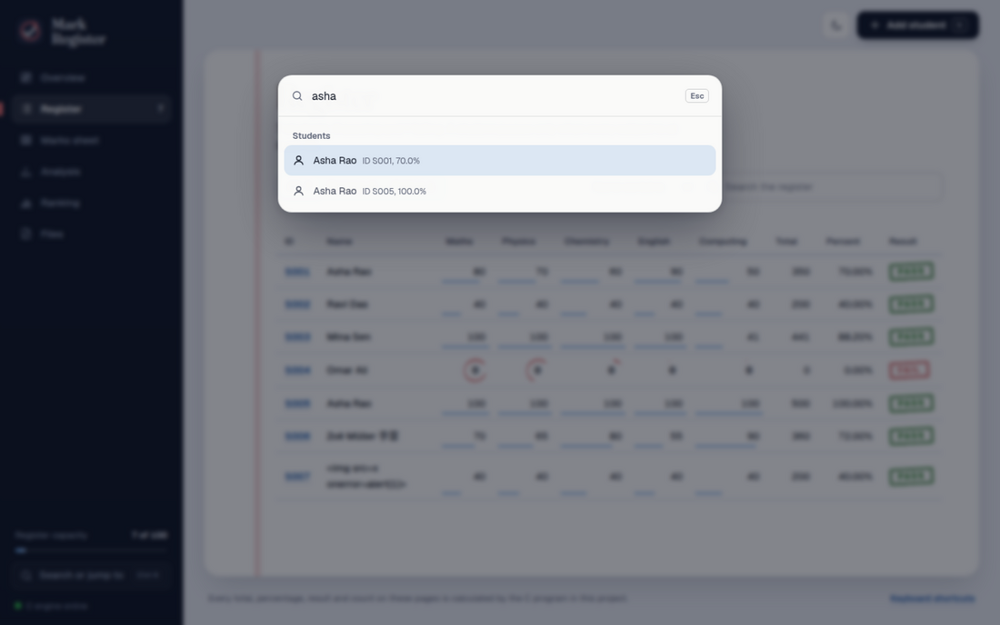
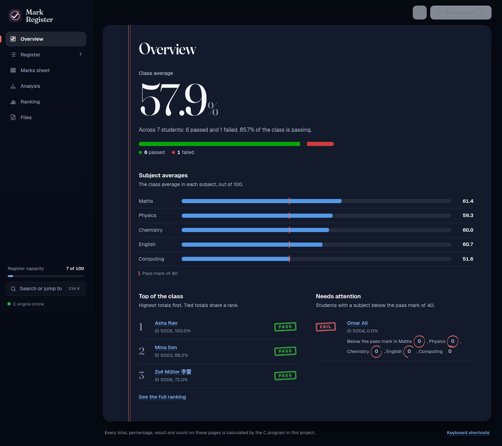
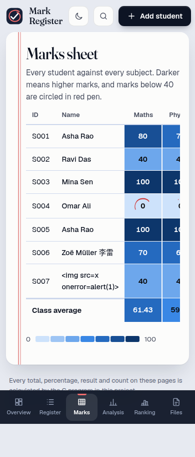

# Mark Register — optional web GUI

A browser front-end for the Student Academic Record system. It is **optional**: the assigned project is
the command-line program in the parent folder, and nothing there depends on this folder.

The GUI does not re-implement the logic. Every total, average, percentage, pass/fail result, class average,
band count, ranking, search, load, save and CSV export is calculated by **the project's own C code**.



```
browser (public/)  <-- HTTP + JSON -->  server.js (Node)  <-- stdin/stdout -->  student_bridge (C)
 pages, drawers, charts                 routing, safety checks                  student.c analysis.c
                                                                                input.c storage.c
```

## Run it

You need a C compiler (`gcc` or Apple's clang), `make` and Node.js 18 or newer (Linux, macOS or WSL). No `npm install` is needed.
On a Mac: `xcode-select --install` and `brew install node` once (see the main README).

```sh
sh gui/start.sh          # builds the bridge, starts the server, opens the browser
# or
make gui-run             # then open http://127.0.0.1:8765
```

Stop with `Ctrl+C`. Records live in the C process's memory, so they are lost when the server stops unless you
use **Files → Save** (saved to `gui/data/`). New to it? Press **Load example students** on an empty page to get
the five hand-calculated students from the project's test dataset.

## What is in the interface

| Page | What it shows (CLI menu option it matches) |
|---|---|
| Overview | The class average as the hero figure, pass/fail meter, subject averages with the pass line, top three, students who need attention (6, 8, 10) |
| Register | Every student with Pass/Fail stamps; filter chips, search by name (contains), exact name or ID, sortable columns; **Add a student** (1, 2, 3, 4, 11) |
| Marks sheet | Student-by-subject heat map with class averages (5) |
| Analysis | Highest/lowest with ties, mark bands as stacked bars with an interactive legend and a table view, pass/fail with the subjects each failed student missed (6, 7, 8) |
| Ranking | Ranked by total, tied totals share a rank (10) |
| Files | Save, load (confirms before replacing), CSV export with download, clear all (12, 13, 14) |

Click any ID to open that student's **report card** in a side drawer: score, total, average, a bar per subject with
the pass line, and why a student failed. From there you can **Edit marks** (9) or **Print report card**.

### The red pen

Marks below the pass mark are circled in red pen (the circles draw themselves when a page opens), results are
stamped PASS or FAIL, and the sheet has a double red margin line, like a school mark register. Motion plays once
on arrival and respects the system "reduce motion" setting.

### Keyboard

| Keys | Action |
|---|---|
| `Ctrl K` (`⌘ K` on Mac) | Command palette: find a student, jump to a page, run an action |
| `/` | Search the register |
| `N` | Add a student |
| `G` then `O` `R` `M` `A` `K` `F` | Go to Overview, Register, Marks sheet, Analysis, Ranking, Files |
| `?` | Show the shortcut list |
| `↑` `↓` in a mark field | Change the mark by 1 (`Shift` for 10) |

Light and dark themes follow the system setting and can be switched with the button in the top bar. On a phone the
sidebar becomes a bottom navigation bar and drawers become bottom sheets.

| | | |
|---|---|---|
|  |  |  |
|  |  | |

Validation messages shown in the forms come from the C code (`is_valid_id`, `is_valid_name`, `parse_int_in_range`);
all problems in a form are listed at once.

## Files

| File | Purpose |
|---|---|
| `bridge.c` | `student_bridge`: reads one command per line, writes one JSON line. Links the project's C modules |
| `server.js` | Static files + `/api/*` over HTTP, talks to the bridge. No npm packages |
| `public/index.html`, `style.css`, `app.js` | Page shell, styles (both themes), entry point: routing, theme, shortcuts |
| `public/lib/` | `dom.js` (safe DOM helpers, icons), `api.js`, `state.js`, `ui.js` (pen circles, stamps, meter, toasts), `drawers.js` (add and report-card drawers), `palette.js` |
| `public/views/` | One module per page: `overview`, `register`, `marks`, `analysis`, `ranking`, `files` |
| `public/fonts/` | Geist and Fraunces (variable fonts, SIL Open Font License, see `LICENSE.txt`) bundled so the GUI works offline |
| `test/api.test.js` | 14 back-end tests (`make gui-test`) |
| `test/e2e/` | 33 checks driving the real page in headless Chrome (`make gui-e2e`) |
| `screenshots/` | Images used in this README (regenerate with `SHOTS=... make gui-e2e`) |
| `start.sh` | Build, start and open |
| `data/` | Created at run time: saved `.dat` files and exported `.csv` files |

## HTTP API

| Request | Bridge command | Result |
|---|---|---|
| `GET /api/info` | `INFO` | subjects, pass mark, capacity, band labels |
| `GET /api/students` | `LIST` | every student with calculated values |
| `GET /api/search?mode=id\|name\|partial&q=` | `SEARCH_ID`, `SEARCH_NAME`, `SEARCH_PARTIAL` | matching students (empty `q` lists everyone) |
| `POST /api/students` `{id,name,marks[]}` | `ADD` | the new student, or `422` with `errors[{field,message}]` |
| `PUT /api/students` `{id,marks[]}` | `UPDATE` | the updated student and the previous total/result |
| `GET /api/marks` `/extremes` `/frequency` `/summary` `/ranking` | `MARKS` … `RANKING` | report data (`summary` includes the class average) |
| `POST /api/save` `/load` `/export` `{file}` | `SAVE`, `LOAD`, `EXPORT` | file operations inside `gui/data/` |
| `GET /api/files`, `GET /files/<name>` | — | list (with size and time) and download saved files |
| `POST /api/clear` | `CLEAR` | empties the register in memory |

The bridge protocol is documented at the top of `bridge.c`.

## Safety

* Listens on `127.0.0.1` only. Requests whose `Host` is not localhost/127.0.0.1, or whose `Origin` is another site,
  are refused (blocks DNS-rebinding and cross-site requests). Request bodies are limited to 32 KB.
* File names must be plain names (letters, digits, dot, dash, underscore); everything stays inside `gui/data/`.
* A strict Content-Security-Policy is sent (`default-src 'none'`; scripts, styles, fonts and images only from this server),
  so the page makes no external requests. Student names are inserted into the page as text, never as HTML.
* There is no login: it is a single-user tool for your own computer. Do not expose the port to a network.

## Tests

```sh
make gui-test    # 14 tests: HTTP -> Node -> C against the hand-calculated S001-S005 dataset,
                 # validation, capacity, files, security and bridge-restart behaviour
make gui-e2e     # 33 browser checks (needs Google Chrome or Chromium; set CHROME=/path if not found)
SHOTS=/tmp/shots make gui-e2e   # also saves screenshots
```

## Limitations

* One user, one in-memory register (the bridge restarts empty if it ever crashes).
* No delete-one-student: the command-line program does not have it either. Use *Edit marks*, or *Clear all* and reload a saved file.
* Needs a POSIX system for the bridge (`dup2` is used to capture library messages); the command-line program itself
  stays portable standard C.
* Page transitions use the browser's View Transitions API where available; other browsers simply switch pages.
